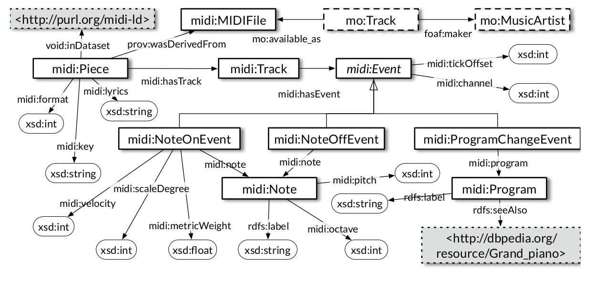

# The MIDI Linked Data Project

**Contributors:**	[Albert Meroño](https://github.com/albertmeronyo), [Rinke Hoekstra](https://github.com/RinkeHoekstra), Aldo Gangemi, Peter Bloem, Reinier de Valk, Bas Stringer, Berit Janssen, Victor de Boer, Alo Allik, Stefan Schlobach, Kevin Page

For the `midi2rdf` converter, see [the project page](https://github.com/midi-ld/midi2rdf) or the [cloud service](http://midi2rdf.amp.ops.labs.vu.nl).

## Table of Contents

1. [Introduction](#introduction)
2. [The MIDI Linked Data Cloud](#tools)
3. [Using the data](#usage)
  * Dumps
  * SPARQL
  * API
4. [Tutorials](#tutorials)
5. [FAQ](#faq)

### Introduction

MIDI Linked Data proposes to use the data publishing method of [Linked Data](https://en.wikipedia.org/wiki/Linked_data) to interconnect symbolic music descriptions (to a great extent very similar to music scores) contained in MIDI files. By doing this, we believe there is a great opportunity to overcome traditional problems in music databases, such as interoperability, entity linking, and semantic relations. By doing this we can, for example, enrich the [DBpedia page of Hey Jude by the Beatles](http://dbpedia.org/page/Hey_Jude) with [all the notes and instruments of Hey Jude by the Beatles](purl.org/midi-ld/pattern/53f034801899d84fd061d73bd4716912).

### The MIDI Linked Data Cloud

To achieve the goal of representing MIDI files as Linked Data, we need two things: a collection of MIDI files, and a "MIDI to RDF" conversion algorithm. The collections of MIDI files we currently represent as MIDI Linked Data can be found in [this list](https://github.com/midi-ld/sources). As for the algorithm, we use [**midi2rdf**](https://github.com/midi-ld/midi2rdf), a Python-based MIDI to RDF converter that uses a simple MIDI ontology to represent MIDI events. The product of applying this algorithm to the source MIDI files is what we call the *MIDI Linked Data Cloud*, which currently contains 10,215,557,355 RDF statements about 308,443 MIDI files.

MIDI files are then represented as RDF graphs which get connected by two different kinds of resources: *notes* and *programs*. Notes are simply the pitches that the MIDI format can represent, all listed in the small [MIDI notes](purl.org/midi-ld/notes/) dataset. Programs are all the instruments (grand piano, electric guitar, etc.) that can play in a MIDI file; they are also listed in a similar [MIDI programs](purl.org/midi-ld/programs/) dataset. These instruments contain links to their equivalent DBpedia resources, so all songs in the MIDI Linked Data Cloud are connected to the rest of the Web via these links.

### Using the data

The data in the MIDI Linked Data Cloud can be accessed in different ways:

- Downloading a data [dump](http://midi-ld.amp.ops.labs.vu.nl/) (beware these are large files!)
- Sending queries in the [SPARQL query language](https://en.wikipedia.org/wiki/SPARQL) to our [SPARQL endpoint](http://virtuoso-midi.amp.ops.labs.vu.nl/sparql)
- Using the MIDI-LD [RESTful API](http://grlc.io/api/midi-ld/queries/)

#### Dumps

#### SPARQL

When you query the SPARQL endpiont, you'll find this diagram useful:

#### API

### Tutorials

### FAQ

